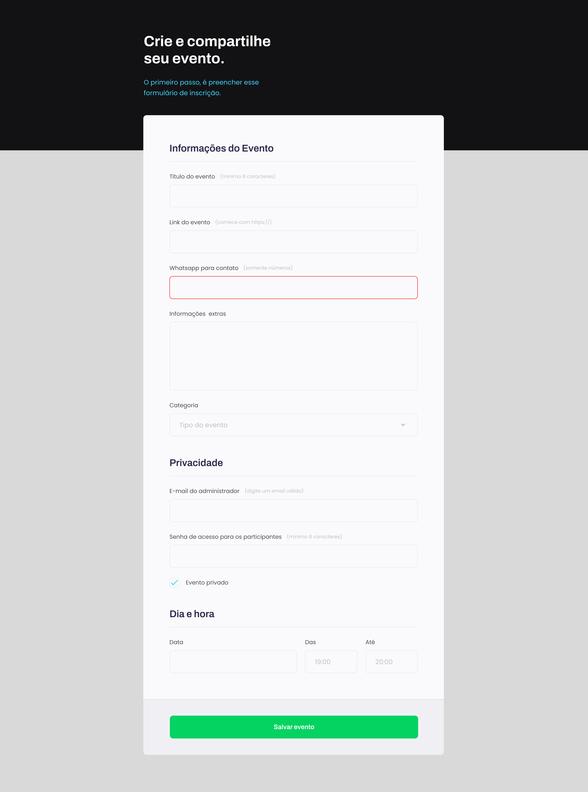

# Explorer-Project-3

## About the Project

The "Explorer-Project-3" is a hands-on learning project focused on mastering essential HTML and CSS concepts. Inspired by a design from Figma, it serves as a practical approach to understanding various web development techniques. You can view the design inspiration here: [Figma Design](https://www.figma.com/file/sgcJKpGAeVqh7rf2pwsOd9/Explorer-Stage-03-Projeto-01/duplicate).

### Learning Objectives

The project encompasses several key areas:

1. **Understanding HTML Fields**: Grasping different HTML field types.
2. **Working with HTML Forms**: Implementing and manipulating forms.
3. **Simulating Google Search**: Creating a Google-like search interface.
4. **Initiating HTML Structure and VSCode Settings**: Setting up the initial project structure and development environment.
5. **Starting Page Styles**: Applying basic CSS styling.
6. **Grouping Fields with Fieldset and Legend**: Organizing form fields.
7. **Formatting Text Fields**: Styling text input fields.
8. **Adjusting New Fields within Fieldset**: Integrating new form fields.
9. **Styling the Select Field**: Customizing dropdowns.
10. **Applying Styles to Remaining Groupings**: Finalizing the styling of field groups.
11. **Custom Checkbox with Accessibility**: Designing accessible, custom checkboxes.
12. **Creating Styles for Submit Button**: Styling the form submission button.
13. **Validating Fields and Submitting Forms**: Implementing form validation and submission logic.

## Project Preview

Below is a preview of the project showcasing the implemented interface. The image 'image.png' is located at the root of the project.

## Project Structure

The project is structured simply, comprising two main files:

- `index.html`: The primary HTML file containing the project's structure.
- `style.css`: The CSS file responsible for the visual styling.

## Clone and Experiment

To clone and try out the project yourself, visit the GitHub repository at: [GitHub Repository](https://github.com/giovannivicentin/explorer-project-3).

## Conclusion

"Explorer-Project-3" provides an excellent opportunity to practice and deepen understanding of HTML and CSS fundamentals, with a particular focus on form creation and styling.
